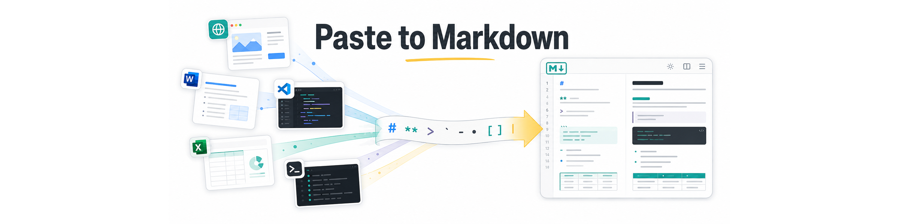

# Paste to Markdown

[](https://github.com/doggy8088/Paste-to-Markdown)
[](https://github.com/doggy8088/Paste-to-Markdown/blob/main/LICENSE)
[](#privacy--security)

A fast, private, and client-side web application for converting clipboard content (HTML, RTF, and plain text) into clean, standard Markdown.

---

## Features

- 📐 **LaTeX & Math Expressions Support**
  - Converts math formulas from clipboard HTML into standard Markdown syntax:
    - Inline math: `$...$`
    - Block math: `$$...$$` and ````math```` code blocks
  - Intelligently extracts TeX source from:
    - KaTeX HTML (`<annotation encoding="application/x-tex">`)
    - MathML (`<math>`) and `<annotation>` tags
    - MathJax containers (`<mjx-container>`) and script elements
    - Wikipedia math formula images (`alt` attribute containing TeX)
    - Custom HTML data attributes (`data-tex`, `data-formula`, `data-latex`)
  - Built-in offline KaTeX rendering in the **Preview** tab with zero external network requests.

- 📋 **Universal Multi-Source Clipboard Conversion**
  - Seamlessly handles rich text copied from:
    - Web browsers (tables, nested lists, headings, blockquotes)
    - Microsoft Word, Outlook, and Office RTF content (cleans up bullet artifacts and spacing)
    - Microsoft Excel spreadsheets (converts to GFM Markdown tables with multiline cell support)
    - VS Code and code editors (preserves indentation and strips redundant margins)
    - Plain text output (such as GitHub Copilot CLI or terminal logs)

- 📑 **Dual-Format (MIME) Clipboard Copy**
  - Dedicated **📋 Copy** button writes both `text/plain` (raw Markdown) and `text/html` (rendered HTML) to the system clipboard simultaneously.
  - Paste into Markdown/code editors to get raw Markdown, or paste directly into rich text editors (Notion, Google Docs, Word, Slack, Teams) with formatting preserved.

- 🔗 **One-Click Shareable Links**
  - Use the **🔗 Share** button to compress and encode your converted Markdown directly into the URL hash.
  - Recipients can open the link to instantly read, preview, or copy the content without requiring any server database or account.

- 👀 **Live Real-Time Preview**
  - Side-by-side or tabbed **Edit** and **Preview** modes with GitHub Flavored Markdown (GFM) tables, syntax rendering, and KaTeX mathematical equation support.

- 🌓 **Theme Switcher**
  - Choose between **System** default, **Light**, and **Dark** modes.
  - Saves your theme preference in local storage with automatic contrast adjustment.

- 🌍 **Multi-Language Support (15 Languages)**
  - Fully translated interface available in:
    - English, 繁體中文, 简体中文, 日本語, 한국어, Español, Français, Português, Русский, العربية (with native RTL support), Türkçe, Tiếng Việt, ภาษาไทย, Bahasa Indonesia, and हिन्दी.

- 🔒 **Privacy & Security**
  - **100% Client-Side**: All parsing, sanitization, and rendering execute entirely within your browser sandbox. No telemetry, no backend server, and no clipboard data is ever sent to the network.
  - Strict HTML sanitization via `DOMParser` blocking malicious scripts, unsafe URLs, and protocol injection.

---

## How to Use

1. **Copy** formatted content from any webpage, document, or application (`Ctrl+C` or `⌘+C`).
2. **Paste** onto the Paste to Markdown window (`Ctrl+V` or `⌘+V`).
3. The content is instantly converted into Markdown:
   - Click **📋 Copy** to copy both Markdown and formatted HTML to your clipboard.
   - Click **🔗 Share** to generate a shareable URL containing the document.
4. **Keyboard Shortcuts**:
   - `Escape`: Clear workspace and reset.
   - `Alt+1` / `Option+1`: Switch to **Edit** tab.
   - `Alt+2` / `Option+2`: Switch to **Preview** tab.

---

## Project Structure

```text
Paste-to-Markdown/
├── index.html                   # Main entry point, layout, and styling
├── Makefile                     # Local server management and syntax check tasks
├── assets/
│   ├── clipboard2markdown.js    # Core app logic, clipboard handling, and KaTeX extensions
│   ├── to-markdown.js           # Custom HTML-to-Markdown conversion utilities
│   ├── bootstrap.css            # Base UI stylesheet
│   ├── workspace-bg-light.png   # Light theme background asset
│   └── workspace-bg-dark.png    # Dark theme background asset
├── vendor/
│   ├── turndown/                # Turndown HTML-to-Markdown converter
│   ├── turndown-plugin-gfm/     # GFM table and task list plugin
│   ├── marked/                  # Markdown parser and renderer
│   └── katex/                   # Local offline KaTeX library, fonts, and stylesheets
└── i18n/                        # Localization dictionaries (15 languages)
```

---

## Local Development

No build tools, npm packages, or bundlers are required. You can serve the project using any static web server:

```bash
# Start local server and automatically open the browser
make

# Or start the server in the background
make serve-bg

# Check background server status
make status

# Stop background server
make stop

# Verify JavaScript syntax
make check
```

---

## Credits

- Based on [to-markdown](https://github.com/domchristie/to-markdown) by Dom Christie.
- Markdown conversion powered by [Turndown](https://github.com/mixmark-io/turndown) and [Marked](https://github.com/markedjs/marked).
- Math rendering powered by [KaTeX](https://katex.org/).
- Style and concept adapted from [Paste to Markdown](https://euangoddard.github.io/clipboard2markdown/) by Euan Goddard.
- Designed, developed, and maintained by [Will 保哥的技術交流中心](https://www.facebook.com/will.fans/).

---

## License

This project is open source and available under the [MIT License](LICENSE).
